# TOÀN CẢNH DỮ LIỆU LÂM SÀNG MIMIC-IV (DATASET DOCUMENTATION)

> 🏥 **Cơ sở dữ liệu:** MIMIC-IV (Medical Information Mart for Intensive Care — Phiên bản 3.1)  
> 📁 **Tổng số bảng thực tế:** **31 bảng** (chia thành 2 module chính: `hosp` gồm **22 bảng** và `icu` gồm **9 bảng**)  
> 🎯 **Mục đích tài liệu:** Trình bày Data Model tổng thể, giải thích súc tích ý nghĩa thực tế lâm sàng của **toàn bộ 31 bảng** và tổng hợp các hướng nghiên cứu của các bài báo khoa học hàng đầu trên bộ dữ liệu này.

---

## MỤC LỤC
1. [Cấu trúc Tổng quan: Phân chia 2 Module hosp & icu](#1-cấu-trúc-tổng-quan-phân-chia-2-module-hosp--icu)
2. [Sơ đồ Data Model Toàn cảnh (Architectural ERD)](#2-sơ-đồ-data-model-toàn-cảnh-architectural-erd)
3. [Ý nghĩa Lâm sàng của 22 Bảng trong Module Bệnh viện Chung (`hosp`)](#3-ý-nghĩa-lâm-sàng-của-22-bảng-trong-module-bệnh-viện-chung-hosp)
   - [3.1. Nhóm Nhân khẩu học & Quản lý Lưu chuyển Bệnh nhân (5 bảng)](#31-nhóm-nhân-khẩu-học--quản-lý-lưu-chuyển-bệnh-nhân-5-bảng)
   - [3.2. Nhóm Mã hóa Bệnh tật, Phẫu thuật & Chi phí (7 bảng)](#32-nhóm-mã-hóa-bệnh-tật-phẫu-thuật--chi-phí-7-bảng)
   - [3.3. Nhóm Cận lâm sàng, Sinh hóa & Vi sinh (3 bảng)](#33-nhóm-cận-lâm-sàng-sinh-hóa--vi-sinh-3-bảng)
   - [3.4. Nhóm Y lệnh, Dược & Quản lý Cấp phát Thuốc (6 bảng)](#34-nhóm-y-lệnh-dược--quản-lý-cấp-phát-thuốc-6-bảng)
   - [3.5. Nhóm Thể chất & Hồ sơ Ngoại trú (1 bảng)](#35-nhóm-thể-chất--hồ-sơ-ngoại-trú-1-bảng)
4. [Ý nghĩa Lâm sàng của 9 Bảng trong Module Chăm sóc Tích cực (`icu`)](#4-ý-nghĩa-lâm-sàng-của-9-bảng-trong-module-chăm-sóc-tích-cực-icu)
5. [Tóm tắt Mối quan hệ Khóa Liên kết Trọng yếu](#5-tóm-tắt-mối-quan-hệ-khóa-liên-kết-trọng-yếu)
6. [Các Bài báo Khoa học Đã Làm Gì trên Dữ liệu MIMIC? (Literature Review)](#6-các-bài-báo-khoa-học-đã-làm-gì-trên-dữ-liệu-mimic-literature-review)
   - [6.1. Nhánh Clinical Text-to-SQL & Hỏi đáp Y tế (Sát nhất với Đề tài)](#61-nhánh-clinical-text-to-sql--hỏi-đáp-y-tế-sát-nhất-với-đề-tài)
   - [6.2. Nhánh Máy học Dự đoán Lâm sàng (Predictive Healthcare)](#62-nhánh-máy-học-dự-đoán-lâm-sàng-predictive-healthcare)
   - [6.3. Nhánh Xử lý Ngôn ngữ Tự nhiên Y sinh & LLM (Clinical NLP)](#63-nhánh-xử-lý-ngôn-ngữ-tự-nhiên-y-sinh--llm-clinical-nlp)
   - [6.4. Vị trí & Tính mới Khoa học của Đồ án này](#64-vị-trí--tính-mới-khoa-học-của-đồ-án-này)

---

## 1. Cấu trúc Tổng quan: Phân chia 2 Module hosp & icu

Cơ sở dữ liệu **MIMIC-IV v3.1** trong thư mục gốc của dự án được tách biệt thành hai thư mục nghiệp vụ:

```
mimic-iv-3.1/
├── hosp/  (22 bảng) ── Toàn bộ dữ liệu bệnh viện tổng quát (Ngoại trú, Nội trú thông thường, Cấp cứu)
└── icu/   (9 bảng)  ── Dữ liệu theo dõi chuyên sâu theo từng phút/giờ tại các khoa Hồi sức cấp cứu tích cực
```

- **Module `hosp` (Hospital-wide - 22 bảng):** Ghi nhận dữ liệu toàn viện: hồ sơ nhân khẩu học bệnh nhân, lịch sử nhập/xuất viện, các mã chẩn đoán ICD, đơn thuốc kê tại khoa dược, xét nghiệm máu/nước tiểu gửi về phòng lab, y lệnh của bác sĩ, hồ sơ chuyển khoa, chi phí bảo hiểm.
- **Module `icu` (Intensive Care Unit - 9 bảng):** Dành riêng cho các bệnh nhân có vào phòng Hồi sức tích cực. Chứa dữ liệu đo liên tục tại giường: monitor theo dõi sinh tồn từng giờ (nhịp tim, huyết áp, SpO2), lượng dịch truyền vào (input), lượng dịch bài tiết (output), cài đặt máy thở, thủ thuật can thiệp hồi sức.

---

## 2. Sơ đồ Data Model Toàn cảnh (Architectural ERD)

Dưới đây là sơ đồ kiến trúc thể hiện luồng liên kết của toàn bộ 31 bảng trong MIMIC-IV:

```mermaid
graph TD
    classDef core fill:#1e3a8a,stroke:#3b82f6,stroke-width:2px,color:#fff;
    classDef hosp fill:#065f46,stroke:#10b981,stroke-width:1px,color:#fff;
    classDef icu fill:#7c2d12,stroke:#f97316,stroke-width:1px,color:#fff;
    classDef dict fill:#475569,stroke:#94a3b8,stroke-width:1px,color:#fff;

    %% CORE DEMOGRAPHICS
    P[patients]:::core --> A[admissions]:::core
    P --> TR[transfers]:::hosp
    P --> OM[omr: BMI/Huyết áp]:::hosp

    %% HOSP MODULE (LINK VIA admissions / hadm_id)
    A --> SE[services]:::hosp
    A --> PR[provider]:::hosp

    %% Diagnoses & Procedures
    A --> DIA[diagnoses_icd]:::hosp
    DIA --- DDIA[d_icd_diagnoses]:::dict
    A --> PRO[procedures_icd]:::hosp
    PRO --- DPRO[d_icd_procedures]:::dict
    A --> HCP[hcpcsevents]:::hosp
    HCP --- DHCP[d_hcpcs]:::dict
    A --> DRG[drgcodes: Phí BHYT]:::hosp

    %% Labs & Microbiology
    A --> LAB[labevents]:::hosp
    LAB --- DLAB[d_labitems]:::dict
    A --> MIC[microbiologyevents]:::hosp

    %% Prescriptions & Orders
    A --> PRE[prescriptions]:::hosp
    A --> PHA[pharmacy]:::hosp
    A --> POE[poe: Y lệnh BS]:::hosp
    POE --> POED[poe_detail]:::hosp
    A --> EMAR[emar: Quét mã vạch thuốc]:::hosp
    EMAR --> EMARD[emar_detail]:::hosp

    %% ICU MODULE (LINK VIA admissions & icustays)
    A --> ICU[icustays]:::core
    ICU --> CE[chartevents: Sinh tồn monitor]:::icu
    CE --- DITM[d_items: Danh mục ICU]:::dict
    ICU --> INP[inputevents: Truyền dịch/thuốc]:::icu
    ICU --> OUT[outputevents: Nước tiểu/dẫn lưu]:::icu
    ICU --> DT[datetimeevents: Mốc giờ can thiệp]:::icu
    ICU --> PRCE[procedureevents: Thở máy/Catheter]:::icu
    ICU --> ING[ingredientevents: Thành phần dịch]:::icu
    ICU --> CG[caregiver: Điều dưỡng trực]:::icu
```



---

## 3. Ý nghĩa Lâm sàng của 22 Bảng trong Module Bệnh viện Chung (`hosp`)

Không cần đi sâu vào từng trường dữ liệu kỹ thuật, dưới đây là ý nghĩa thực tế và vai trò của từng bảng:

### 3.1. Nhóm Nhân khẩu học & Quản lý Lưu chuyển Bệnh nhân (5 bảng)
1. **`patients` (Hồ sơ nhân khẩu học bệnh nhân):**
   - *Ý nghĩa:* Bảng danh tính cốt lõi của từng cá nhân. Chứa giới tính, tuổi mốc tham chiếu, và ngày mất (nếu bệnh nhân đã qua đời ngoài đời thực).
2. **`admissions` (Lịch sử các đợt nhập viện):**
   - *Ý nghĩa:* Quản lý từng đợt bệnh nhân tới bệnh viện. Lưu ngày giờ vào viện, ra viện, phân loại nhập viện (cấp cứu hay mổ phiên), bảo hiểm, chủng tộc và đặc biệt là **tình trạng tử vong trong viện** (`hospital_expire_flag`).
3. **`transfers` (Nhật ký chuyển khoa phòng):**
   - *Ý nghĩa:* Ghi lại hành trình di chuyển thực tế của người bệnh qua các khoa: phòng cấp cứu (ED), khoa khám bệnh, các khoa điều trị nội trú, và các buồng hồi sức (ICU).
4. **`services` (Chuyên khoa điều trị phụ trách):**
   - *Ý nghĩa:* Ghi nhận khoa y tế chuyên môn đang nhận phụ trách ca bệnh tại từng thời điểm (ví dụ: `MED` - Khoa Nội, `SURG` - Khoa Ngoại, `CMED` - Khoa Tim mạch, `TRAUM` - Khoa Chấn thương).
5. **`provider` (Danh mục y bác sĩ & nhân viên y tế):**
   - *Ý nghĩa:* Mã hóa ẩn danh danh tính của các bác sĩ, điều dưỡng, chuyên gia thực hiện khám và điều trị cho bệnh nhân.

---

### 3.2. Nhóm Mã hóa Bệnh tật, Phẫu thuật & Chi phí (7 bảng)
6. **`diagnoses_icd` (Danh sách chẩn đoán bệnh):**
   - *Ý nghĩa:* Toàn bộ các bệnh mà bệnh nhân được bác sĩ kết luận trong đợt nhập viện theo chuẩn quốc tế ICD-9 hoặc ICD-10. Đánh dấu được đâu là **chẩn đoán chính** (`seq_num = 1`) và các bệnh lý nền/biến chứng kèm theo.
7. **`d_icd_diagnoses` (Từ điển tên bệnh ICD):**
   - *Ý nghĩa:* Bảng tra cứu để dịch mã ICD (như `I10`, `J189`) thành tên bệnh đầy đủ tiếng Anh (như *"Essential hypertension"*, *"Pneumonia"*).
8. **`procedures_icd` (Thủ thuật & phẫu thuật can thiệp):**
   - *Ý nghĩa:* Danh sách các can thiệp phẫu thuật hoặc thủ thuật chuyên khoa mà bệnh nhân phải trải qua trong đợt điều trị (mã hóa theo chuẩn ICD).
9. **`d_icd_procedures` (Từ điển tên thủ thuật ICD):**
   - *Ý nghĩa:* Bảng dịch mã thủ thuật ICD thành tên mô tả phẫu thuật cụ thể.
10. **`hcpcsevents` (Mã dịch vụ y tế HCPCS/CPT):**
    - *Ý nghĩa:* Ghi nhận các dịch vụ xét nghiệm, chẩn đoán hình ảnh, thủ thuật ngoại trú được mã hóa theo hệ thống tính phí bảo hiểm y tế HCPCS của Mỹ.
11. **`d_hcpcs` (Từ điển dịch vụ HCPCS):**
    - *Ý nghĩa:* Tra cứu tên đầy đủ của các gói dịch vụ tính phí y tế.
12. **`drgcodes` (Nhóm chẩn đoán tính viện phí - Diagnosis Related Groups):**
    - *Ý nghĩa:* Phân loại bệnh nhân vào các nhóm bệnh tương đồng về chi phí để thanh toán bảo hiểm y tế (bảo hiểm chi trả trọn gói theo mã DRG).

---

### 3.3. Nhóm Cận lâm sàng, Sinh hóa & Vi sinh (3 bảng)
13. **`labevents` (Kết quả xét nghiệm cận lâm sàng):**
    - *Ý nghĩa:* Bảng kết quả lab khổng lồ lưu trữ hàng triệu xét nghiệm sinh hóa, huyết học, nước tiểu, khí máu (như men gan, Creatinine, Glucose, Hemoglobin), giá trị đo được, đơn vị và cờ đánh dấu kết quả **bất thường** (`abnormal`).
14. **`d_labitems` (Từ điển chỉ số xét nghiệm):**
    - *Ý nghĩa:* Tra cứu mã xét nghiệm thành tên chỉ số dễ hiểu (như *"Creatinine"*, *"Potassium"*, *"WBC"*), phân loại theo dịch xét nghiệm (máu, nước tiểu, dịch não tủy) và bộ môn sinh hóa.
15. **`microbiologyevents` (Kết quả nuôi cấy vi sinh & kháng sinh đồ):**
    - *Ý nghĩa:* Ghi nhận việc cấy máu, cấy nước tiểu hoặc dịch mủ xem có mọc vi khuẩn hay nấm không, tên vi khuẩn tìm thấy (như tụ cầu vàng, E. coli) và kết quả thử nghiệm thuốc kháng sinh (nhạy cảm, kháng thuốc hay trung gian).

---

### 3.4. Nhóm Y lệnh, Dược & Quản lý Cấp phát Thuốc (6 bảng)
16. **`prescriptions` (Đơn thuốc lâm sàng):**
    - *Ý nghĩa:* Danh sách thuốc bác sĩ kê cho bệnh nhân, bao gồm tên hoạt chất, liều lượng, đơn vị tính, đường dùng (tiêm tĩnh mạch, uống, bôi ngoài da) và thời gian dùng.
17. **`pharmacy` (Hồ sơ quản lý tại khoa Dược):**
    - *Ý nghĩa:* Theo dõi chi tiết chu trình của một đơn thuốc từ lúc bác sĩ gửi yêu cầu, dược sĩ duyệt, đến khi xuất kho giao về khoa lâm sàng.
18. **`poe` (Provider Order Entry - Y lệnh điện tử của bác sĩ):**
    - *Ý nghĩa:* Ghi nhận các lệnh điện tử mà bác sĩ ban hành trên hệ thống (lệnh lấy máu, lệnh truyền dịch, lệnh đo điện tim, hội chẩn).
19. **`poe_detail` (Chi tiết y lệnh):**
    - *Ý nghĩa:* Các tham số chi tiết đi kèm của y lệnh (ví dụ: tần suất thực hiện, chỉ định khẩn hay thường quy).
20. **`emar` (Electronic Medication Administration Record - Quét mã vạch dùng thuốc):**
    - *Ý nghĩa:* Nhật ký quét mã vạch thực tế của điều dưỡng tại giường bệnh ngay trước khi tiêm/cho bệnh nhân uống thuốc (đảm bảo nguyên tắc 5 đúng trong điều dưỡng).
21. **`emar_detail` (Chi tiết thực hiện thuốc):**
    - *Ý nghĩa:* Liều lượng thực tế đã đưa vào người bệnh nhân, vị trí tiêm hoặc lý do nếu bệnh nhân từ chối uống thuốc.

---

### 3.5. Nhóm Thể chất & Hồ sơ Ngoại trú (1 bảng)
22. **`omr` (Online Medical Record - Chỉ số thể chất & Khám sức khỏe):**
    - *Ý nghĩa:* Ghi nhận các chỉ số cơ bản của bệnh nhân được đo lường ngoại trú qua các năm: chỉ số khối cơ thể (BMI), chiều cao, cân nặng, và huyết áp đo lúc nghỉ.

---

## 4. Ý nghĩa Lâm sàng của 9 Bảng trong Module Chăm sóc Tích cực (`icu`)

Khi bệnh nhân rơi vào tình trạng nguy kịch chuyển vào phòng ICU, toàn bộ dữ liệu theo dõi theo thời gian thực được thu thập vào 9 bảng này:

23. **`icustays` (Đợt điều trị tại ICU):**
    - *Ý nghĩa:* Bảng cầu nối trung tâm của toàn bộ module ICU. Một đợt nhập viện (`hadm_id`) có thể có 1 hoặc nhiều lần chuyển vào ICU (`stay_id`). Lưu ngày giờ vào và ra khỏi phòng ICU.
24. **`chartevents` (Dữ liệu Monitor & Phiếu theo dõi sinh tồn tại giường):**
    - *Ý nghĩa:* Bảng có dung lượng lớn nhất trong toàn bộ cơ sở dữ liệu. Lưu trữ toàn bộ các chỉ số sinh tồn đo tự động từ máy monitor hoặc điều dưỡng ghi chép định kỳ hàng giờ: nhịp tim, nhịp thở, huyết áp động mạch xâm lấn, SpO2, điểm hôn mê Glasgow (GCS)...
25. **`d_items` (Từ điển danh mục chỉ số ICU):**
    - *Ý nghĩa:* Tra cứu hàng nghìn mã số trong các bảng ICU thành tên tham số đo đạc cụ thể (như *"Heart Rate"*, *"Invasive Blood Pressure"*).
26. **`inputevents` (Lượng dịch và thuốc truyền vào):**
    - *Ý nghĩa:* Đo lường lượng chất lỏng đưa vào người bệnh nhân nguy kịch: truyền máu, dịch truyền tĩnh mạch (NaCl, Ringer Lactate), các loại thuốc vận mạch truyền bơm tiêm điện liên tục (Noradrenaline, Vasopressin), và dinh dưỡng qua ống sonde.
27. **`outputevents` (Lượng dịch bài tiết ra ngoài):**
    - *Ý nghĩa:* Theo dõi sát sao lượng dịch cơ thể thải ra theo từng giờ: lượng nước tiểu qua ống thông foley (chỉ số vàng đánh giá suy thận cấp), dịch dẫn lưu màng phổi, dịch hút dạ dày, chất nôn.
28. **`datetimeevents` (Các mốc thời gian can thiệp quan trọng):**
    - *Ý nghĩa:* Lưu lại chính xác thời điểm xảy ra các can thiệp cấp cứu: giờ đặt ống nội khí quản, giờ rút ống, thời điểm sốc điện khử rung tim.
29. **`procedureevents` (Thủ thuật can thiệp tại ICU):**
    - *Ý nghĩa:* Ghi nhận quá trình thực hiện các thủ thuật hồi sức chuyên sâu: thời gian thở máy xâm nhập, đặt đường truyền tĩnh mạch trung tâm (CVC), lọc máu liên tục (CRRT), đặt ống thông động mạch.
30. **`ingredientevents` (Thành phần hoạt chất pha chế):**
    - *Ý nghĩa:* Bóc tách nồng độ từng hoạt chất đơn lẻ có trong các chai dịch truyền phức hợp đưa vào cơ thể bệnh nhân.
31. **`caregiver` (Mã điều dưỡng phụ trách):**
    - *Ý nghĩa:* Ghi nhận mã ẩn danh của điều dưỡng hoặc bác sĩ trực tiếp thực hiện y lệnh can thiệp tại giường ICU.

---

## 5. Tóm tắt Mối quan hệ Khóa Liên kết Trọng yếu

| Cặp bảng | Khóa liên kết | Bản chất quan hệ |
|---|---|---|
| `patients` ➔ `admissions` | `subject_id` | **1 Bệnh nhân có N đợt nhập viện** |
| `admissions` ➔ `icustays` | `hadm_id` | **1 Đợt nằm viện có thể có N đợt nằm ICU** |
| `admissions` ➔ (`diagnoses_icd`, `labevents`, `prescriptions`...) | `hadm_id` | **1 Đợt nằm viện phát sinh N chẩn đoán, xét nghiệm, đơn thuốc** |
| `icustays` ➔ (`chartevents`, `inputevents`, `outputevents`...) | `stay_id` | **1 Đợt nằm ICU phát sinh hàng nghìn bản ghi theo dõi sinh tồn** |
| Bảng sự kiện ➔ Bảng từ điển (`d_*`) | `icd_code`, `itemid` | **Ánh xạ mã kỹ thuật thành tên bệnh/tên xét nghiệm người đọc được** |

---

## 6. Các Bài báo Khoa học Đã Làm Gì trên Dữ liệu MIMIC? (Literature Review)

Cơ sở dữ liệu MIMIC là dữ liệu nền tảng cho hàng nghìn công trình nghiên cứu y sinh và trí tuệ nhân tạo trên thế giới. Dưới đây là phân loại các hướng nghiên cứu lớn nhất:

```
                            CÁC HƯỚNG NGHIÊN CỨU TRÊN MIMIC
                                           │
         ┌─────────────────────────────────┼─────────────────────────────────┐
         │                                 │                                 │
[Clinical Text-to-SQL & QA]     [Machine Learning Lâm sàng]       [Clinical NLP & LLM]
 - EHRSQL (NeurIPS/NAACL)        - Dự đoán tử vong (Mortality)     - Gán mã ICD tự động (CAML)
 - BiomedSQL                     - Dự đoán thời gian nằm (LOS)     - Trích xuất thông tin bệnh án
 - SMART-SLIC (2025)             - Dự đoán Sepsis-3 & SOFA         - Sinh tóm tắt xuất viện
 - ViText2SQL Clinical (Đồ án)   - Dự đoán tái nhập viện 30 ngày   - Mô hình Clinical-BERT
```

### 6.1. Nhánh Clinical Text-to-SQL & Hỏi đáp Y tế (Sát nhất với Đề tài)

Các bài báo hướng này chuyển đổi câu hỏi ngôn ngữ tự nhiên thành câu lệnh SQL truy vấn trực tiếp kho dữ liệu hồ sơ bệnh án điện tử (EHR):

1. **EHRSQL: A Practical Text-to-SQL Benchmark on Electronic Health Records (KAIST — NeurIPS 2022 / NAACL 2024)**
   - *Tác giả:* Gyubok Lee, Hyeonji Hwang, Baehoon Choi, Edward Choi.
   - *Họ đã làm gì:* Xây dựng benchmark chuẩn mực đầu tiên thế giới trên MIMIC-III và MIMIC-IV với sự tham gia của 222 y bác sĩ. Đưa ra chuẩn đánh giá độ chính xác thực thi (*Execution Accuracy - EX*) và cơ chế từ chối câu hỏi không thể trả lời (*Unanswerable Questions*).
   - *Hạn chế:* **Chỉ giải bài toán tiếng Anh đơn ngữ**, chưa hỗ trợ giải thích ngược kết quả cho bác sĩ (SQL-to-Text) và chưa xử lý hội thoại đa lượt tỉnh lược phức tạp.

2. **SMART-SLIC & M3-SQL: Multi-task Clinical Text-to-SQL (2024 - 2025)**
   - *Họ đã làm gì:* Xây dựng màng lọc RAG vector để chọn lọc động schema và từ điển ICD đưa vào prompt của LLM, giúp mô hình không bị quá tải ngữ cảnh và giảm 70% lỗi bịa tên cột/tên bảng (hallucination).

3. **BiomedSQL & Gen-SQL (MIT / Stanford)**
   - *Họ đã làm gì:* Nghiên cứu việc sinh SQL có kiểm soát an toàn (chỉ sinh lệnh `SELECT`, cấm tuyệt đối các thao tác thay đổi dữ liệu `UPDATE`/`DROP`) trên dữ liệu sinh học bệnh án.

---

### 6.2. Nhánh Máy học Dự đoán Lâm sàng (Predictive Healthcare)

Sử dụng dữ liệu chuỗi thời gian của các bảng `admissions`, `labevents`, `transfers`, `chartevents` để huấn luyện các mô hình Machine Learning/Deep Learning (XGBoost, LSTM, Transformer):

1. **Dự đoán Nguy cơ Tử vong Nội viện (In-Hospital Mortality Prediction):**
   - Sử dụng các chỉ số xét nghiệm và dấu hiệu sinh tồn trong 24 giờ đầu khi bệnh nhân vào ICU để dự đoán xác suất tử vong (`hospital_expire_flag`).
   - *Công trình tiêu biểu:* MIMIC-Extract (Wang et al., 2020), Purushotham et al. (2018).
2. **Dự đoán Thời gian Nằm viện (Length of Stay - LOS):**
   - Phân loại xem bệnh nhân có nằm lại viện trên 7 ngày hay không để hỗ trợ lãnh đạo bệnh viện điều phối giường bệnh và máy thở.
3. **Phát hiện Sớm Nhiễm khuẩn huyết (Sepsis-3 Detection) & Điểm Suy Đa tạng (SOFA Score):**
   - Tự động tính toán thang điểm SOFA dựa trên bảng xét nghiệm máu (Creatinine, Bilirubin, Tiểu cầu) và bảng thuốc vận mạch trong `inputevents` để cảnh báo sốc nhiễm khuẩn trước 4-6 giờ.
4. **Dự đoán Tái nhập viện Cấp cứu trong 30 ngày (30-Day Readmission):**
   - Đánh giá nguy cơ bệnh nhân phải quay lại viện khẩn cấp sau khi xuất viện để có phác đồ chăm sóc tại nhà phù hợp.

---

### 6.3. Nhánh Xử lý Ngôn ngữ Tự nhiên Y sinh & LLM (Clinical NLP)

Khai thác các trường văn bản lâm sàng kết hợp với các bảng mã hóa chuẩn quốc tế:

1. **Gán mã bệnh tự động (Automated ICD Coding from Clinical Notes):**
   - *Bài báo tiêu biểu:* CAML (Mullenbach et al., NAACL 2018), PLM-ICD (2022).
   - Mô hình đọc hồ sơ xuất viện (Discharge Summaries) và tự động gán mã ICD-9/10 vào bảng `diagnoses_icd`, giúp tự động hóa khâu thanh toán bảo hiểm y tế.
2. **Các Mô hình Ngôn ngữ Chuyên ngành Lâm sàng:**
   - *Clinical-BERT, Med-PaLM, BioMistral:* Được tiếp tục huấn luyện nâng cao trên dữ liệu văn bản bệnh viện để hiểu sâu các từ viết tắt chuyên môn, tên thuốc và triệu chứng lâm sàng.

---

### 6.4. Vị trí & Tính mới Khoa học của Đồ án này

So sánh với các nghiên cứu lớn trên thế giới, đồ án tốt nghiệp của bạn giải quyết trực diện **khoảng trống lớn chưa từng có công trình nào giải quyết đồng thời**:

| Tiêu chí | EHRSQL (2022, 2024) | ViText2SQL (2020) | ĐỒ ÁN NÀY (Hệ thống MIMIC Text-to-SQL) |
|---|---|---|---|
| **Ngôn ngữ người dùng** | Chỉ Tiếng Anh | Tiếng Việt | **Tiếng Việt chuyên ngành Y khoa (Cross-lingual)** |
| **Miền tri thức (Domain)** | Y tế lâm sàng (EHR) | Dữ liệu tổng quát (Spider) | **Y tế lâm sàng chuẩn MIMIC-IV** |
| **Ánh xạ Thuật ngữ** | Tra trực tiếp mã tiếng Anh | Không có tri thức y tế | **RAG 3 tầng: Ánh xạ bệnh tiếng Việt sang ICD-9/10** |
| **Kiểm tra an toàn truy vấn** | Chỉ chạy thử (Try-catch) | Chạy thử | **Màng lọc tĩnh Schema-Aware Validator + Agentic Self-Correction** |
| **Hội thoại Đa lượt** | Độc lập từng câu | Hạn chế | **Context-Aware Rewriter (viết lại câu hỏi tỉnh lược)** |
| **Chu trình hệ thống** | Một chiều (Text ➔ SQL) | Một chiều (Text ➔ SQL) | **Hai chiều khép kín (Text ➔ SQL ➔ Diễn giải lâm sàng tiếng Việt)** |
