# TÀI LIỆU DỮ LIỆU LÂM SÀNG MIMIC-IV (DATASET DOCUMENTATION)

> 📅 **Cập nhật:** Tháng 09/2026  
> 🏥 **Cơ sở dữ liệu:** MIMIC-IV (Medical Information Mart for Intensive Care, Phiên bản 3.1)  
> 🎯 **Mục đích:** Đặc tả mô hình dữ liệu (Data Model / ERD), chi tiết 12 bảng thực thể, quan hệ nghiệp vụ lâm sàng và tổng kết các công trình khoa học khai thác dữ liệu này.

---

## MỤC LỤC
1. [Tổng quan về Bộ dữ liệu MIMIC-IV](#1-tổng-quan-về-bộ-dữ-liệu-mimic-iv)
2. [Mô hình Dữ liệu Quan hệ (Data Model / ERD)](#2-mô-hình-dữ-liệu-quan-hệ-data-model--erd)
3. [Đặc tả Chi tiết 12 Bảng Cốt lõi](#3-đặc-tả-chi-tiết-12-bảng-cốt-lõi)
   - [3.1. Nhóm Bệnh nhân & Nhập viện (Core Demographics & Admissions)](#31-nhóm-bệnh-nhân--nhập-viện-core-demographics--admissions)
   - [3.2. Nhóm Chẩn đoán & Thủ thuật (Diagnoses & Procedures)](#32-nhóm-chẩn-đoán--thủ-thuật-diagnoses--procedures)
   - [3.3. Nhóm Cận lâm sàng & Điều trị (Lab, Medication & Microbiology)](#33-nhóm-cận-lâm-sàng--điều-trị-lab-medication--microbiology)
   - [3.4. Nhóm Luồng di chuyển & Khoa phòng (Tracking & Movement)](#34-nhóm-luồng-di-chuyển--khoa-phòng-tracking--movement)
4. [Các Quy tắc Nghiệp vụ & Cạm bẫy Viết SQL Cần Lưu ý](#4-các-quy-tắc-nghiệp-vụ--cạm-bẫy-viết-sql-cần-lưu-ý)
5. [Tổng quan Nghiên cứu Khoa học (Literature Review): Các Bài báo Đã Làm Gì trên Dữ liệu Này?](#5-tổng-quan-nghiên-cứu-khoa-học-literature-review-các-bài-báo-đã-làm-gì-trên-dữ-liệu-này)
   - [5.1. Nhánh Clinical Text-to-SQL & QA (Trực diện với Đồ án)](#51-nhánh-clinical-text-to-sql--qa-trực-diện-với-đồ-án)
   - [5.2. Nhánh Máy học Dự đoán Lâm sàng (Predictive Healthcare)](#52-nhánh-máy-học-dự-đoán-lâm-sàng-predictive-healthcare)
   - [5.3. Nhánh Xử lý Ngôn ngữ Tự nhiên Y sinh & LLM (Clinical NLP)](#53-nhánh-xử-lý-ngôn-ngữ-tự-nhiên-y-sinh--llm-clinical-nlp)
   - [5.4. Định vị Tính mới Khoa học của Đồ án này](#54-định-vị-tính-mới-khoa-học-của-đồ-án-này)

---

## 1. Tổng quan về Bộ dữ liệu MIMIC-IV

### 1.1. Nguồn gốc & Tính chuẩn mực
- **MIMIC-IV** (*Medical Information Mart for Intensive Care*) là cơ sở dữ liệu y tế công khai chuẩn mực quốc tế (de-facto gold standard) được quản lý bởi **Viện Công nghệ Massachusetts (MIT)** phối hợp cùng **Trung tâm Y tế Beth Israel Deaconess (BIDMC, Boston, Hoa Kỳ)**.
- Dữ liệu ghi lại toàn bộ quá trình nhập viện, chăm sóc tích cực (ICU), cấp cứu (ED), kết quả xét nghiệm, đơn thuốc và hồ sơ bệnh án của hàng chục nghìn bệnh nhân thực tế từ năm 2008 đến 2019.
- Dữ liệu đã được **ẩn danh hóa nghiêm ngặt (de-identified)** theo chuẩn HIPAA:
  - Tên tuổi bệnh nhân được mã hóa thành `subject_id`.
  - Mốc thời gian được dịch chuyển ngẫu nhiên cho từng bệnh nhân nhưng giữ nguyên khoảng cách thời gian tương đối (relative intervals) giữa các sự kiện lâm sàng.
  - Người trên 89 tuổi được gom nhóm mốc tuổi (`anchor_age = 91`) để bảo mật danh tính.

### 1.2. Tập con Triển khai trong Dự án (MIMIC-IV Mini)
Để tối ưu hóa tốc độ thực thi, khả năng lập chỉ mục vector và đánh giá thực nghiệm:
- **Quy mô:** 500 bệnh nhân đại diện toàn diện các mặt bệnh phổ biến.
- **Số bảng tích hợp:** 12 bảng trọng yếu nhất.
- **Số dòng dữ liệu:** Hơn 236,000 bản ghi thực tế được nạp trực tiếp vào hệ quản trị cơ sở dữ liệu PostgreSQL.

---

## 2. Mô hình Dữ liệu Quan hệ (Data Model / ERD)

Toàn bộ hệ thống dữ liệu xoay quanh hai thực thể cốt lõi:
- **`patients` (bệnh nhân):** Đại diện cho một cá nhân duy nhất qua trường khóa chính `subject_id`.
- **`admissions` (đợt nhập viện):** Mỗi bệnh nhân có thể có một hoặc nhiều đợt nhập viện, xác định bởi khóa chính `hadm_id`.

```mermaid
erDiagram
    PATIENTS ||--o{ ADMISSIONS : "1 bệnh nhân có N đợt nhập viện (subject_id)"
    PATIENTS ||--o{ LABEVENTS : "subject_id"
    PATIENTS ||--o{ TRANSFERS : "subject_id"
    
    ADMISSIONS ||--o{ DIAGNOSES_ICD : "1 đợt có N mã chẩn đoán (hadm_id)"
    ADMISSIONS ||--o{ PROCEDURES_ICD : "1 đợt có N thủ thuật (hadm_id)"
    ADMISSIONS ||--o{ LABEVENTS : "1 đợt có N xét nghiệm lab (hadm_id)"
    ADMISSIONS ||--o{ PRESCRIPTIONS : "1 đợt có N đơn thuốc (hadm_id)"
    ADMISSIONS ||--o{ TRANSFERS : "1 đợt có N lần đổi khoa (hadm_id)"
    ADMISSIONS ||--o{ SERVICES : "1 đợt chuyển N dịch vụ y tế (hadm_id)"
    ADMISSIONS ||--o{ MICROBIOLOGYEVENTS : "1 đợt cấy N mẫu vi sinh (hadm_id)"

    DIAGNOSES_ICD }o--|| D_ICD_DIAGNOSES : "tra tên bệnh (icd_code, icd_version)"
    PROCEDURES_ICD }o--|| D_ICD_PROCEDURES : "tra tên thủ thuật (icd_code, icd_version)"
    LABEVENTS }o--|| D_LABITEMS : "tra tên xét nghiệm (itemid)"

    PATIENTS {
        int subject_id PK "Mã bệnh nhân duy nhất"
        varchar gender "M: Nam, F: Nữ"
        int anchor_age "Tuổi tại năm mốc tham chiếu"
        int anchor_year "Năm mốc đã dịch chuyển bảo mật"
        varchar anchor_year_group "Nhóm năm (VD: 2011 - 2013)"
        date dod "Ngày mất (NULL nếu còn sống)"
    }

    ADMISSIONS {
        int hadm_id PK "Mã đợt nhập viện duy nhất"
        int subject_id FK "Mã bệnh nhân liên kết"
        timestamp admittime "Thời điểm nhập viện"
        timestamp dischtime "Thời điểm xuất viện"
        timestamp deathtime "Thời điểm tử vong tại viện"
        varchar admission_type "Loại nhập viện (EMERGENCY, ELECTIVE...)"
        varchar admission_location "Nguồn nhập viện (EMERGENCY ROOM, CLINIC...)"
        varchar discharge_location "Nơi chuyển đến khi ra viện"
        varchar insurance "Bảo hiểm y tế"
        varchar race "Chủng tộc / dân tộc"
        int hospital_expire_flag "1: Tử vong trong viện, 0: Xuất viện sống"
    }

    DIAGNOSES_ICD {
        int subject_id FK "Mã bệnh nhân"
        int hadm_id FK "Mã đợt nhập viện"
        int seq_num "1: Chẩn đoán chính (Primary), >1: Chẩn đoán phụ"
        varchar icd_code "Mã bệnh theo chuẩn ICD"
        int icd_version "Phiên bản ICD: 9 hoặc 10"
    }

    D_ICD_DIAGNOSES {
        varchar icd_code PK "Mã bệnh ICD"
        int icd_version PK "Phiên bản: 9 hoặc 10"
        varchar long_title "Tên tiếng Anh chi tiết của bệnh"
    }

    PROCEDURES_ICD {
        int subject_id FK "Mã bệnh nhân"
        int hadm_id FK "Mã đợt nhập viện"
        int seq_num "Thứ tự ưu tiên thủ thuật"
        date chartdate "Ngày thực hiện thủ thuật"
        varchar icd_code "Mã thủ thuật ICD"
        int icd_version "Phiên bản: 9 hoặc 10"
    }

    D_ICD_PROCEDURES {
        varchar icd_code PK "Mã thủ thuật ICD"
        int icd_version PK "Phiên bản: 9 hoặc 10"
        varchar long_title "Tên đầy đủ của thủ thuật"
    }

    LABEVENTS {
        bigint labevent_id PK "Mã xét nghiệm duy nhất"
        int subject_id FK "Mã bệnh nhân"
        int hadm_id FK "Mã đợt nhập viện"
        int itemid FK "Mã chỉ số xét nghiệm"
        timestamp charttime "Thời gian lấy/ghi nhận mẫu"
        float valuenum "Kết quả định lượng dạng số"
        varchar valueuom "Đơn vị đo (mg/dL, mmol/L...)"
        float ref_range_lower "Ngưỡng bình thường dưới"
        float ref_range_upper "Ngưỡng bình thường trên"
        varchar flag "'abnormal' nếu ngoài khoảng tham chiếu"
        varchar priority "Mức ưu tiên: STAT (khẩn), ROUTINE"
    }

    D_LABITEMS {
        int itemid PK "Mã chỉ số xét nghiệm"
        varchar label "Tên xét nghiệm (Creatinine, Glucose...)"
        varchar fluid "Bệnh phẩm dịch: Blood, Urine, CSF..."
        varchar category "Nhóm sinh hóa: Chemistry, Hematology..."
    }

    PRESCRIPTIONS {
        int subject_id FK "Mã bệnh nhân"
        int hadm_id FK "Mã đợt nhập viện"
        timestamp starttime "Thời điểm bắt đầu cấp/dùng thuốc"
        timestamp stoptime "Thời điểm kết thúc/dừng thuốc"
        varchar drug "Tên hoạt chất/biệt dược thuốc"
        varchar dose_val_rx "Liều lượng quy định"
        varchar dose_unit_rx "Đơn vị liều (mg, mL, UI...)"
        varchar route "Đường dùng: IV, PO, SQ, ORAL..."
    }

    TRANSFERS {
        int transfer_id PK "Mã lần chuyển khoa duy nhất"
        int subject_id FK "Mã bệnh nhân"
        int hadm_id FK "Mã đợt nhập viện"
        varchar careunit "Tên khoa: MICU, SICU, Emergency Dept..."
        varchar eventtype "Sự kiện: admit, transfer, discharge"
        timestamp intime "Thời điểm vào khoa"
        timestamp outtime "Thời điểm rời khoa"
    }

    SERVICES {
        int subject_id FK "Mã bệnh nhân"
        int hadm_id FK "Mã đợt nhập viện"
        timestamp transfertime "Thời gian chuyển dịch vụ điều trị"
        varchar prev_service "Dịch vụ y tế trước đó"
        varchar curr_service "Dịch vụ y tế hiện tại (MED, SURG, CMED...)"
    }

    MICROBIOLOGYEVENTS {
        bigint microevent_id PK "Mã xét nghiệm vi sinh"
        int subject_id FK "Mã bệnh nhân"
        int hadm_id FK "Mã đợt nhập viện"
        timestamp charttime "Thời gian lấy mẫu"
        varchar spec_type_desc "Mẫu cấy: BLOOD CULTURE, URINE..."
        varchar org_name "Tên vi khuẩn phát hiện"
        varchar interpretation "Kháng sinh đồ: S (nhạy), R (kháng), I (trung gian)"
    }
```



---

## 3. Đặc tả Chi tiết 12 Bảng Cốt lõi

### 3.1. Nhóm Bệnh nhân & Nhập viện (Core Demographics & Admissions)

#### Bảng `patients`
- **Ý nghĩa:** Chứa dữ liệu nhân khẩu học cố định của bệnh nhân trong toàn bộ lịch sử bệnh viện.
- **Các trường chính:**
  - `subject_id` *(INT, PK)*: Định danh duy nhất của từng bệnh nhân.
  - `gender` *(VARCHAR)*: Giới tính (`'M'` - Nam, `'F'` - Nữ).
  - `anchor_age` *(INT)*: Tuổi của bệnh nhân tại năm mốc `anchor_year`.
  - `anchor_year` *(INT)*: Năm mốc giả định phục vụ bảo mật thông tin.
  - `anchor_year_group` *(VARCHAR)*: Khung năm tương đối (ví dụ: `'2008 - 2010'`, `'2014 - 2016'`).
  - `dod` *(DATE)*: Ngày tử vong (*Date of Death*). Có giá trị `NULL` nếu bệnh nhân còn sống sau khi xuất viện.

#### Bảng `admissions`
- **Ý nghĩa:** Chứa thông tin về các đợt bệnh nhân đến điều trị tại bệnh viện (nội trú hoặc cấp cứu).
- **Các trường chính:**
  - `hadm_id` *(INT, PK)*: Mã đợt nhập viện duy nhất (*Hospital Admission ID*).
  - `subject_id` *(INT, FK)*: Liên kết tới `patients.subject_id`.
  - `admittime` *(TIMESTAMP)*: Ngày giờ nhập viện.
  - `dischtime` *(TIMESTAMP)*: Ngày giờ xuất viện.
  - `deathtime` *(TIMESTAMP)*: Ngày giờ tử vong trong đợt nằm viện (nếu có).
  - `admission_type` *(VARCHAR)*: Phân loại tiếp nhận (`'EMERGENCY'`, `'ELECTIVE'`, `'URGENT'`, `'OBSERVATION ADMIT'`).
  - `admission_location` *(VARCHAR)*: Nơi chuyển đến (`'EMERGENCY ROOM'`, `'PHYSICIAN REFERRAL'`...).
  - `discharge_location` *(VARCHAR)*: Nơi đến sau xuất viện (`'HOME'`, `'SKILLED NURSING FACILITY'`, `'DIED'`).
  - `insurance` *(VARCHAR)*: Chế độ bảo hiểm (`'Medicare'`, `'Medicaid'`, `'Other'`).
  - `race` *(VARCHAR)*: Chủng tộc / sắc tộc của bệnh nhân.
  - `hospital_expire_flag` *(INT)*: Cờ tử vong nội viện: `1` = tử vong trong đợt nằm viện, `0` = sống sót xuất viện.

---

### 3.2. Nhóm Chẩn đoán & Thủ thuật (Diagnoses & Procedures)

#### Bảng `diagnoses_icd`
- **Ý nghĩa:** Danh sách các mã bệnh chẩn đoán được gán cho bệnh nhân trong đợt nhập viện theo chuẩn ICD (International Classification of Diseases).
- **Các trường chính:**
  - `subject_id`, `hadm_id` *(INT)*: Định danh bệnh nhân và đợt nhập viện.
  - `seq_num` *(INT)*: Thứ tự ưu tiên chẩn đoán. **`seq_num = 1` là chẩn đoán chính (Primary Diagnosis)** dẫn đến việc nhập viện; các số tiếp theo là bệnh kèm theo hoặc biến chứng.
  - `icd_code` *(VARCHAR)*: Mã bệnh chuẩn không có dấu chấm (ví dụ: `'I10'`, `'J189'`, `'486'`).
  - `icd_version` *(INT)*: Phiên bản phân loại (`9` cho ICD-9-CM, `10` cho ICD-10-CM).

#### Bảng `d_icd_diagnoses` (Từ điển tra cứu chẩn đoán)
- **Ý nghĩa:** Bảng tham chiếu danh mục tên bệnh quốc tế.
- **Các trường chính:**
  - `icd_code` *(VARCHAR)* & `icd_version` *(INT)*: Cặp khóa chính phức hợp.
  - `long_title` *(VARCHAR)*: Tên bệnh mô tả chi tiết bằng tiếng Anh (ví dụ: *"Pneumonia, unspecified organism"*).

#### Bảng `procedures_icd` & `d_icd_procedures`
- **Ý nghĩa:** Ghi nhận các thủ thuật y khoa hoặc phẫu thuật can thiệp trong đợt điều trị.
- **Cấu trúc:** Tương tự như bảng chẩn đoán ICD, gồm mã thủ thuật `icd_code`, phiên bản `icd_version`, thứ tự `seq_num` và ngày tiến hành `chartdate`. Bảng danh mục `d_icd_procedures` cung cấp mô tả chi tiết tên thủ thuật `long_title`.

---

### 3.3. Nhóm Cận lâm sàng & Điều trị (Lab, Medication & Microbiology)

#### Bảng `labevents` & `d_labitems`
- **Ý nghĩa:** Lưu trữ toàn bộ các kết quả xét nghiệm sinh hóa, huyết học, khí máu, nước tiểu...
- **Các trường chính của `labevents`:**
  - `labevent_id` *(BIGINT, PK)*: Mã kết quả xét nghiệm duy nhất.
  - `itemid` *(INT, FK)*: Mã chỉ số xét nghiệm, liên kết tới `d_labitems.itemid`.
  - `charttime` *(TIMESTAMP)*: Thời điểm mẫu được xét nghiệm.
  - `valuenum` *(FLOAT)*: Kết quả xét nghiệm dạng số (dùng để so sánh ngưỡng `>`, `<`).
  - `valueuom` *(VARCHAR)*: Đơn vị đo (`'mg/dL'`, `'mmol/L'`, `'g/dL'`).
  - `ref_range_lower`, `ref_range_upper` *(FLOAT)*: Khoảng tham chiếu bình thường.
  - `flag` *(VARCHAR)*: Đánh dấu bất thường (`'abnormal'` nếu vượt ngoài khoảng tham chiếu).
- **Bảng `d_labitems`:**
  - `label` *(VARCHAR)*: Tên xét nghiệm thông dụng (ví dụ: `'Creatinine'`, `'Glucose'`, `'Hemoglobin'`, `'Platelet Count'`).
  - `fluid` *(VARCHAR)*: Loại dịch xét nghiệm (`'Blood'`, `'Urine'`, `'CSF'`).
  - `category` *(VARCHAR)*: Phân ngành xét nghiệm (`'Chemistry'`, `'Hematology'`, `'Blood Gas'`).

#### Bảng `prescriptions`
- **Ý nghĩa:** Nhật ký cấp phát thuốc và phác đồ điều trị dược lâm sàng.
- **Các trường chính:**
  - `drug` *(VARCHAR)*: Tên hoạt chất hoặc tên thuốc (ví dụ: `'Heparin'`, `'Insulin'`, `'Aspirin'`, `'Vancomycin'`).
  - `dose_val_rx` *(VARCHAR)* & `dose_unit_rx` *(VARCHAR)*: Liều dùng và đơn vị.
  - `route` *(VARCHAR)*: Đường đưa thuốc (`'IV'` - tiêm truyền tĩnh mạch, `'PO'` - uống, `'SQ'` - tiêm dưới da, `'ORAL'`).
  - `starttime`, `stoptime` *(TIMESTAMP)*: Thời gian bắt đầu và kết thúc dùng thuốc.

#### Bảng `microbiologyevents`
- **Ý nghĩa:** Kết quả nuôi cấy vi sinh vật và làm kháng sinh đồ.
- **Các trường chính:**
  - `spec_type_desc` *(VARCHAR)*: Loại bệnh phẩm cấy (`'BLOOD CULTURE'`, `'URINE'`, `'SPUTUM'`).
  - `org_name` *(VARCHAR)*: Tên chủng vi sinh vật phân lập được (ví dụ: `'STAPHYLOCOCCUS AUREUS'`).
  - `interpretation` *(VARCHAR)*: Kết quả kháng sinh đồ (`'S'` = Sensitive/Nhạy cảm, `'R'` = Resistant/Kháng thuốc, `'I'` = Intermediate/Trung gian).

---

### 3.4. Nhóm Luồng di chuyển & Khoa phòng (Tracking & Movement)

#### Bảng `transfers`
- **Ý nghĩa:** Theo dõi hành trình di chuyển thực tế của bệnh nhân qua các khoa phòng điều trị (đặc biệt là khoa Hồi sức tích cực - ICU).
- **Các trường chính:**
  - `transfer_id` *(INT, PK)*: Mã lần chuyển khoa.
  - `careunit` *(VARCHAR)*: Tên khoa điều trị (ví dụ: `'Medical Intensive Care Unit (MICU)'`, `'Surgical Intensive Care Unit (SICU)'`, `'Emergency Department'`).
  - `eventtype` *(VARCHAR)*: Loại sự kiện (`'admit'`, `'transfer'`, `'discharge'`).
  - `intime`, `outtime` *(TIMESTAMP)*: Thời điểm vào và ra khỏi khoa.

#### Bảng `services`
- **Ý nghĩa:** Ghi nhận sự chuyển giao giữa các khối dịch vụ lâm sàng chuyên khoa.
- **Các trường chính:**
  - `curr_service` *(VARCHAR)*: Chuyên khoa phụ trách hiện tại (`'MED'` - Nội khoa, `'SURG'` - Ngoại khoa, `'CMED'` - Tim mạch can thiệp, `'TRAUM'` - Chấn thương chỉnh hình).

---

## 4. Các Quy tắc Nghiệp vụ & Cạm bẫy Viết SQL Cần Lưu ý

Khi viết câu lệnh SQL hoặc xây dựng màng lọc `SQL Validator` cho mô hình, bắt buộc phải tuân thủ các nguyên tắc sau:

| # | Vấn đề nghiệp vụ | Cạm bẫy thường gặp | Giải pháp chuẩn mực |
|---|---|---|---|
| **1** | **Bệnh nhân vs. Đợt nhập viện** | Hỏi *"Có bao nhiêu bệnh nhân..."* nhưng lại dùng `COUNT(hadm_id)` hoặc `COUNT(*)` dẫn đến trùng lặp số người khi một người nhập viện nhiều lần. | • Hỏi người/bệnh nhân: `COUNT(DISTINCT p.subject_id)`<br>• Hỏi số ca/đợt nhập viện: `COUNT(DISTINCT a.hadm_id)` |
| **2** | **Phiên bản mã ICD kép** | Mã `'486'` ở ICD-9 là viêm phổi, nhưng ở ICD-10 lại là mã khác. Nếu chỉ JOIN theo `icd_code` sẽ ghép sai bệnh hoàn toàn. | Bắt buộc JOIN trên cả hai cột:<br>`ON d.icd_code = di.icd_code AND d.icd_version = di.icd_version` |
| **3** | **Chẩn đoán chính vs. Chẩn đoán phụ** | Bác sĩ hỏi *"nhập viện do bệnh X"* nhưng query không lọc `seq_num`, lấy cả những bệnh nhân bị bệnh nền từ trước. | Thêm điều kiện `seq_num = 1` nếu muốn tìm lý do nhập viện chính. |
| **4** | **Tính thời gian nằm viện (LOS - Length of Stay)** | Các cột thời gian trong database nếu lưu dạng TEXT thì phép trừ `dischtime - admittime` sẽ gây lỗi kiểu dữ liệu. | Ép kiểu TIMESTAMP trước khi tính:<br>`EXTRACT(EPOCH FROM (dischtime::TIMESTAMP - admittime::TIMESTAMP))/86400` |
| **5** | **Xác định tỷ lệ tử vong nội viện** | Nhầm lẫn giữa tử vong sau xuất viện (`dod IS NOT NULL`) và tử vong ngay tại bệnh viện. | Tử vong tại viện bắt buộc dùng:<br>`hospital_expire_flag = 1` hoặc `deathtime IS NOT NULL` trong bảng `admissions`. |
| **6** | **Xét nghiệm bất thường** | Cố gắng so sánh `valuenum` với `ref_range` thủ công trong khi bảng đã có cờ chuẩn hóa. | Sử dụng trực tiếp điều kiện `flag = 'abnormal'` trong bảng `labevents`. |

---

## 5. Tổng quan Nghiên cứu Khoa học (Literature Review): Các Bài báo Đã Làm Gì trên Dữ liệu Này?

Cơ sở dữ liệu MIMIC là dữ liệu nền tảng cho hàng nghìn công trình nghiên cứu y sinh và trí tuệ nhân tạo trên thế giới. Dưới đây là phân loại các hướng nghiên cứu lớn nhất:

```
                            CÁC HƯỚNG NGHIÊN CỨU TRÊN MIMIC
                                           │
         ┌─────────────────────────────────┼─────────────────────────────────┐
         │                                 │                                 │
[Clinical Text-to-SQL & QA]     [Machine Learning Lâm sàng]       [Clinical NLP & LLM]
 - EHRSQL (NeurIPS/NAACL)        - Dự đoán tử vong (Mortality)     - Gán mã ICD tự động (CAML)
 - BiomedSQL                     - Dự đoán thời gian nằm (LOS)     - Trích xuất thông tin bệnh án
 - SMART-SLIC (2025)             - Dự đoán Sepsis-3 & SOFA         - Sinh tóm tắt xuất viện
 - ViText2SQL Clinical (Đồ án)   - Dự đoán tái nhập viện 30 ngày   - Mô hình Clinical-BERT
```

### 5.1. Nhánh Clinical Text-to-SQL & QA (Trực diện với Đồ án)

Các bài báo hướng này chuyển đổi câu hỏi ngôn ngữ tự nhiên thành câu lệnh SQL truy vấn trực tiếp kho dữ liệu hồ sơ bệnh án điện tử (EHR):

1. **EHRSQL: A Practical Text-to-SQL Benchmark on Electronic Health Records (KAIST - NeurIPS 2022 / NAACL 2024)**
   - *Tác giả:* Gyubok Lee, Hyeonji Hwang, Baehoon Choi, Edward Choi.
   - *Nội dung:* Bộ benchmark lớn nhất thế giới xây dựng trên MIMIC-III và MIMIC-IV với hơn 222 nhân viên y tế đóng góp các câu hỏi thực tế. Đưa ra chuẩn đánh giá độ chính xác thực thi (*Execution Accuracy - EX*) và cơ chế xử lý câu hỏi không thể trả lời (*Unanswerable Questions*).
   - *Hạn chế:* **Chỉ xử lý đơn ngữ tiếng Anh**, chưa hỗ trợ cơ chế giải thích ngược kết quả cho bác sĩ (SQL-to-Text) và chưa xử lý hội thoại đa lượt phụ thuộc ngữ cảnh sâu.

2. **SMART-SLIC: Schema-Aware RAG with Large Language Models for Clinical Text-to-SQL (2024 - 2025)**
   - *Nội dung:* Tập trung giải quyết vấn đề Schema Linking khổng lồ của MIMIC bằng cách kết hợp màng lọc RAG vector để chỉ chọn lọc 2-3 bảng có liên quan đưa vào prompt của LLM, giảm 70% hiện tượng hallucination tên cột/bảng.

3. **BiomedSQL & Gen-SQL (MIT / Stanford)**
   - *Nội dung:* Các nghiên cứu kết hợp mô hình xác suất và LLM để sinh SQL cho dữ liệu sinh học và bệnh án, tập trung vào độ an toàn truy vấn (chỉ cho phép lệnh SELECT, không cho phép mutate dữ liệu).

---

### 5.2. Nhánh Máy học Dự đoán Lâm sàng (Predictive Healthcare)

Sử dụng chuỗi thời gian của bảng `admissions`, `labevents`, `transfers` và `prescriptions` làm đầu vào cho các mô hình học máy (XGBoost, LSTM, Transformer):

1. **Dự đoán Nguy cơ Tử vong Nội viện (In-Hospital Mortality Prediction):**
   - Sử dụng các chỉ số xét nghiệm và sinh hiệu trong 24 giờ đầu khi bệnh nhân vào khoa ICU để dự đoán xác suất tử vong (`hospital_expire_flag`).
   - *Công trình tiêu biểu:* MIMIC-Extract (Wang et al., 2020), Purushotham et al. (2018).
2. **Dự đoán Thời gian Nằm viện (Length of Stay - LOS):**
   - Phân loại xem bệnh nhân có nằm lại viện trên 7 ngày hay không để hỗ trợ lãnh đạo bệnh viện điều phối giường bệnh và máy thở.
3. **Phát hiện Sớm Nhiễm khuẩn huyết (Sepsis-3 Detection) & Thang điểm Suy Đa tạng (SOFA Score):**
   - Dùng dữ liệu xét nghiệm creatinine, bilirubin, tiểu cầu, khí máu để tự động tính điểm SOFA theo từng giờ, phát hiện sốc nhiễm khuẩn trước 4-6 tiếng.
4. **Dự đoán Tái nhập viện trong 30 ngày (30-Day Readmission):**
   - Dự đoán bệnh nhân sau khi xuất viện có nguy cơ tái nhập viện cấp cứu trong vòng 30 ngày hay không.

---

### 5.3. Nhánh Xử lý Ngôn ngữ Tự nhiên Y sinh & LLM (Clinical NLP)

Khai thác các trường văn bản phi cấu trúc (discharge summaries, radiology reports) kết hợp với các bảng mã hóa:

1. **Gán mã bệnh tự động (Automated ICD Coding from Clinical Notes):**
   - *Bài báo tiêu biểu:* CAML (Mullenbach et al., NAACL 2018), PLM-ICD (2022).
   - Mô hình đọc toàn bộ bệnh án xuất viện và tự động dự đoán các mã ICD-9/10 để nạp vào bảng `diagnoses_icd`, giải phóng thời gian nhập liệu thủ công của điều dưỡng.
2. **Các Mô hình Ngôn ngữ Chuyên ngành Lâm sàng:**
   - *Clinical-BERT, Med-PaLM, BioMistral:* Được tiếp tục tiền huấn luyện (pre-train) trên kho dữ liệu văn bản của MIMIC để hiểu sâu thuật ngữ y khoa, thuốc và từ viết tắt lâm sàng.

---

### 5.4. Định vị Tính mới Khoa học của Đồ án này

So sánh với bức tranh nghiên cứu toàn cầu, đồ án tốt nghiệp của bạn giải quyết trực diện **khoảng trống lớn chưa từng có công trình nào giải quyết đồng thời**:

| Tiêu chí | EHRSQL (2022, 2024) | ViText2SQL (2020) | ĐỒ ÁN NÀY (Hệ thống MIMIC Text-to-SQL) |
|---|---|---|---|
| **Ngôn ngữ người dùng** | Chỉ Tiếng Anh | Tiếng Việt | **Tiếng Việt chuyên ngành Y khoa (Cross-lingual)** |
| **Miền tri thức (Domain)** | Y tế lâm sàng (EHR) | Dữ liệu tổng quát (Spider) | **Y tế lâm sàng chuẩn MIMIC-IV** |
| **Ánh xạ Thuật ngữ** | Tra trực tiếp mã tiếng Anh | Không có tri thức y tế | **RAG 3 tầng: Ánh xạ bệnh tiếng Việt sang ICD-9/10** |
| **Kiểm tra an toàn truy vấn** | Chỉ chạy thử (Try-catch) | Chạy thử | **Màng lọc tĩnh Schema-Aware Validator + Agentic Self-Correction** |
| **Hội thoại Đa lượt** | Độc lập từng câu | Hạn chế | **Context-Aware Rewriter (viết lại câu hỏi tỉnh lược)** |
| **Chu trình hệ thống** | Một chiều (Text ➔ SQL) | Một chiều (Text ➔ SQL) | **Hai chiều khép kín (Text ➔ SQL ➔ Diễn giải lâm sàng tiếng Việt)** |

---

## 6. Kết luận
Tài liệu này cung cấp nền tảng tri thức hoàn chỉnh về cấu trúc 12 bảng của cơ sở dữ liệu **MIMIC-IV**, các mối quan hệ khóa ngoại then chốt, cũng như các lưu ý nghiệp vụ khi truy vấn. Đồng thời, phần tổng kết các công trình khoa học khẳng định vị trí và tính mới học thuật của hệ thống trong lĩnh vực tin học y tế và Text-to-SQL đa ngôn ngữ.
