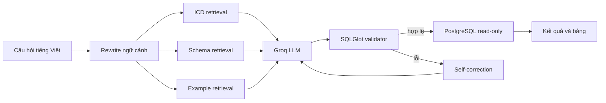

# MIMIC-IV Vietnamese Text-to-SQL

Hệ thống chuyển câu hỏi y tế tiếng Việt thành PostgreSQL cho một subset MIMIC-IV. Pipeline gồm truy hồi mã ICD, schema và SQL mẫu; sinh SQL bằng Groq; kiểm tra AST; thực thi trong transaction chỉ đọc; tự sửa khi truy vấn lỗi; và giao diện hội thoại Streamlit.

## Trạng thái dữ liệu

- Schema logic: **31 bảng** (`22 hosp + 9 icu`).
- Few-shot production: **101** ví dụ.
- Few-shot dành cho evaluation: **73** ví dụ sau khi loại **28** SQL trùng gold test.
- Benchmark: **180** câu, có nhãn `easy`, `medium`, `hard`, `complex`.
- Chroma: `icd_dictionary=10000`, `schema_dictionary=31`, `sql_examples=101`, `sql_examples_eval=73` sau khi build đầy đủ.

Dữ liệu MIMIC-IV gốc và vector database không được commit. Người chạy phải có quyền truy cập MIMIC-IV hợp lệ và tự đặt dữ liệu trong thư mục được cấu hình bởi `MIMIC_DATA_DIR`.

## Luồng xử lý



Validator chỉ chấp nhận một `SELECT` hoặc `WITH ... SELECT`, hiểu alias/CTE/subquery, kiểm tra bảng và cột theo `mimic_schema.json`, chặn truy cập schema ngoài `public`, hàm hệ thống nguy hiểm và JOIN ICD/eMAR thiếu khóa. `run_query()` luôn kiểm tra lại SQL, đặt `statement_timeout`, `lock_timeout`, transaction read-only và giới hạn số dòng trả về.

## Cài đặt

Yêu cầu Python 3.12, Docker Desktop và dữ liệu MIMIC-IV 3.1 đã giải nén.

```powershell
python -m venv .venv
.\.venv\Scripts\Activate.ps1
python -m pip install -r requirements.txt
Copy-Item .env.example .env
```

Điền `GROQ_API_KEY`, mật khẩu PostgreSQL và `MIMIC_DATA_DIR` trong `.env`. Tài khoản `DB_USER` dùng bởi ứng dụng nên là `mimic_reader`; `DB_LOADER_USER` chỉ dùng khi dựng dữ liệu.

Khởi động PostgreSQL mới:

```powershell
docker compose up -d postgres
```

Init script tạo role `mimic_reader` khi volume PostgreSQL được tạo lần đầu. Với volume cũ, cần tự tạo role read-only hoặc tạo volume mới trước khi chạy ứng dụng.

## Dựng dữ liệu và vector

```powershell
python build_mimic_mini.py
python build_vector_db.py
```

Loader chọn 500 bệnh nhân theo seed cố định, đồng thời giữ độ bao phủ cho mã ICD xuất hiện trong benchmark và cho cohort ICU. Các cột ngày/giờ được tạo đúng kiểu PostgreSQL. Có thể đổi kích thước bằng `N_PATIENTS` trong môi trường.

Nếu PostgreSQL chưa chạy nhưng dữ liệu CSV gốc đã có, có thể dựng riêng ICD từ CSV:

```powershell
python build_vector_db.py --collections icd_dictionary --icd-source csv
```

Collection mới được dựng dưới tên tạm, kiểm tra số lượng, rồi mới thay collection cũ. Có thể dựng chọn lọc:

```powershell
python build_vector_db.py --collections schema_dictionary sql_examples sql_examples_eval
```

## Chạy và kiểm thử

```powershell
python -m unittest discover -s tests -v
python -m streamlit run app.py
```

Đánh giá nhanh hoặc chạy một số mode:

```powershell
python evaluate.py --quick --modes base full full_agentic
```

`evaluate.py` chạy preflight toàn bộ gold SQL trước khi gọi LLM. EX dùng multiset của các dòng nên giữ được bản ghi trùng, không phụ thuộc thứ tự hàng hay alias cột. Gold trả về rỗng được báo riêng và không tính vào EX. Kết quả gồm metric tổng và metric theo độ khó.

## Quyền riêng tư

Mặc định `SEND_RESULTS_TO_LLM=false`: dữ liệu hàng từ MIMIC chỉ hiển thị cục bộ và không được gửi lại cho LLM để diễn giải. Bật tùy chọn này chỉ sau khi đã kiểm tra điều khoản sử dụng dữ liệu và chính sách lưu giữ của nhà cung cấp. Câu hỏi và prompt tạo SQL vẫn được gửi đến Groq.

## Các file chính

- `rag_engine.py`: retrieval, prompt, LLM, self-correction và thực thi SQL.
- `sql_validator.py`: kiểm tra AST và schema.
- `build_mimic_mini.py`: dựng PostgreSQL subset.
- `build_vector_db.py`: dựng bốn collection Chroma.
- `evaluate.py`: benchmark VSR/EX.
- `mimic_schema.json`: schema nguồn dùng chung bởi RAG và validator.
- `mimic_examples.json`: 101 few-shot examples.
- `test_dataset.json`: 180 test cases.
